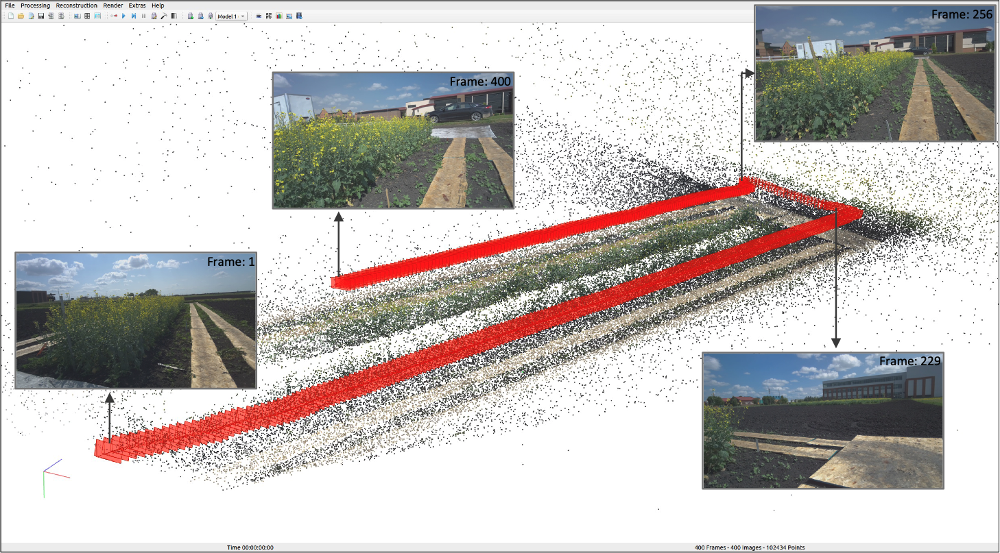
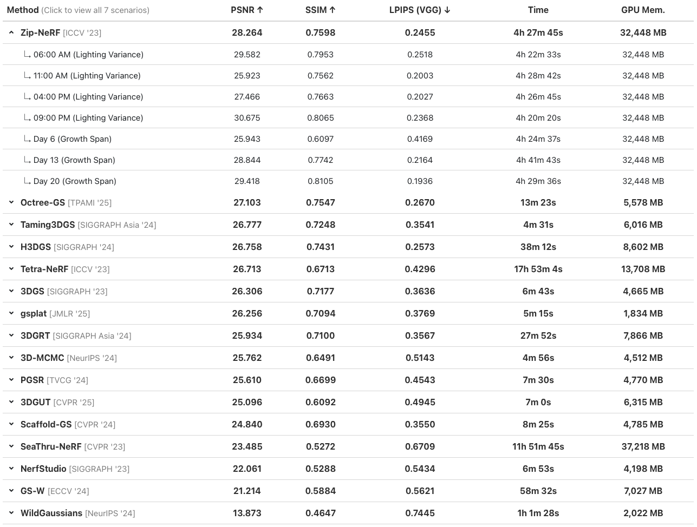
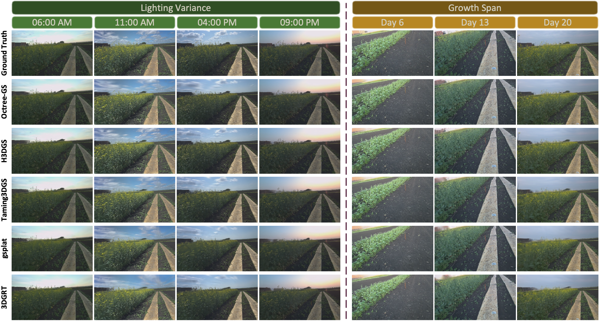

# 📊 Benchmark & Evaluation


## 1. What is this Benchmark?
We benchmark Novel View Synthesis on AgriChrono across **Seven Scenarios** characterized by **Lighting Variance** and **Growth Span**. Each scenario comprises 400 images (960×540) partitioned into 350 for training and 50 for testing. This benchmark assesses the robustness of methods against drastic **illumination changes** and **morphological variations** of **non-rigid objects** in unstructured outdoor environments.

---

## 2. Data Preparation & Evaluation Protocol 

<p align="center">
  
</p>

### 📂 **[Download Benchmark Dataset](https://ucla.box.com/s/xemhedod23tnimcvkou6kbupay3kpue1)**  

### Dataset Overview

- **Coverage**: Covers the entirety of Site 1 across 7 scenarios.
- **Sampling**: Each scenario consists of a batch of 400 frames.
- **Interval**: Curated by sampling every 7 frames, resulting in a uniform spatial interval of ∼9 cm

### Data Structure (COLMAP Format)

- **RGB Images**: Resized to 960 × 540 resolution.
- **Camera Intrinsics**: Corresponding intrinsic camera parameters included.
- **3D Point Cloud**: Sparse 3D point cloud (sampled at 0.1% from Depth).
- **Camera Extrinsics**: Extrinsic camera pose derived from VIO.

### Experimental Setup (Novel View Synthesis)

- **Data Split**:
  - **Training**: 350 images
  - **Testing**: 50 images
- **Evaluation Metrics**: PSNR, SSIM

---

## 3. Benchmark Results

> **Note**: These results can be viewed more conveniently on the [**Project Page**](https://jaehwan-j.github.io/agrichrono/).

### 🔹 Quantitative Results

<p align="center">
  
</p>

### 🔹 Qualitative Results

<p align="center">
  
</p>


---

## **📜 Citation**  
```tex
@article{jeong2025agrichrono,
  title={AgriChrono: A Multi-modal Dataset Capturing Crop Growth and Lighting Variability with a Field Robot},
  author={Jeong, Jaehwan and Vu, Tuan-Anh and Jony, Mohammad and Ahmad, Shahab and Rahman, Md. Mukhlesur and Kim, Sangpil and Jawed, M. Khalid},
  journal={arXiv preprint arXiv:2508.18694},
  year={2025},
}
```